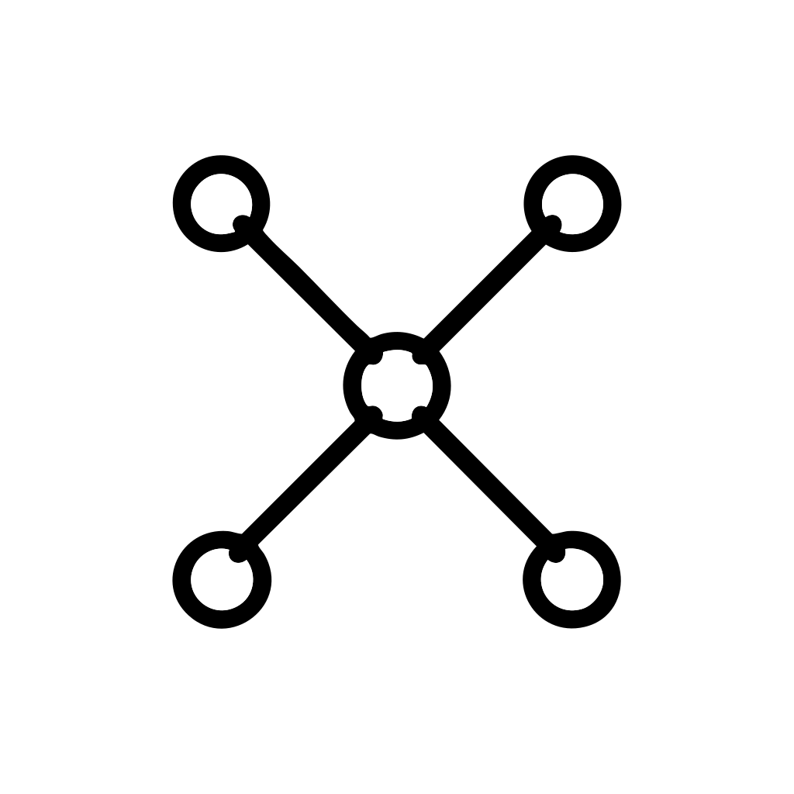

<p align="center">
  
</p>

# Harness

A Claude Code plugin for autonomous multi-session development. Based on [Anthropic's research on effective harnesses for long-running agents](https://www.anthropic.com/engineering/effective-harnesses-for-long-running-agents).

## Philosophy

Large projects can't be completed in a single session. This plugin provides a framework for:

- **Breaking work into discrete features** - 50-200 testable features per project
- **Clarifying requirements upfront** - Asks questions before generating features
- **Documentation-driven development** - Each feature includes relevant doc URLs
- **Autonomous execution** - Runs through ALL features without human intervention
- **Atomic commits** - Each feature gets its own commit
- **Preserving original specifications** - Hooks prevent editing feature descriptions
- **Tracking progress visibly** - Session logs and git history tell the story

## Installation

### Option A: Plugin Installation (with --plugin-dir)

Use the `--plugin-dir` flag to load the plugin directly:

```bash
git clone https://github.com/mikkelkrogsholm/harness /tmp/harness-plugin
claude --plugin-dir /tmp/harness-plugin
```

Commands will be namespaced as `/harness:init`, `/harness:continue`, `/harness:status`.

### Option B: Manual Installation (copy to .claude/)

For simpler slash command names and no plugin setup required:

```bash
# Clone the repo
git clone https://github.com/mikkelkrogsholm/harness /tmp/harness-plugin

# Create .claude directories in your project
mkdir -p .claude/{commands,agents,scripts}

# Copy components
cp /tmp/harness-plugin/commands/*.md .claude/commands/
cp /tmp/harness-plugin/agents/*.md .claude/agents/
cp /tmp/harness-plugin/scripts/*.sh .claude/scripts/

# Make scripts executable
chmod +x .claude/scripts/*.sh
```

**Important**: For manual installation, update hook paths in the agent files:

```bash
# In .claude/agents/project-bootstrap.md and .claude/agents/incremental-workflow.md
# Change: ${CLAUDE_PLUGIN_ROOT}/scripts/
# To: .claude/scripts/
```

Or use this sed command:
```bash
sed -i '' 's|\${CLAUDE_PLUGIN_ROOT}/scripts/|.claude/scripts/|g' .claude/agents/*.md
```

Commands will be `/harness-init`, `/harness-continue`, `/harness-status` (no namespace prefix).

## Usage

### 1. Initialize a Project

```
/harness:init Build a task management app with auth, projects, and real-time sync
```

(Or `/harness-init` for manual installation)

The bootstrap agent will:

1. **Ask clarifying questions** about:
   - Tech stack (frontend, backend, database)
   - Authentication method
   - Scope (MVP vs full product)
   - Third-party integrations
   - Special requirements

2. **Research documentation** for chosen technologies

3. **Create files** with documentation URLs attached to each feature:
   - `feature_list.json` - All features with status tracking and doc URLs
   - `claude-progress.txt` - Session log with assumptions documented
   - `init.sh` - Development environment setup

### 2. Continue Development

```
/harness:continue
```

(Or `/harness-continue` for manual installation)

This runs autonomously until complete:

```
WHILE incomplete features exist:
    1. Get next feature (by priority)
    2. Call incremental-workflow agent (fresh context)
    3. Agent consults documentation URLs
    4. Agent implements, verifies, commits
    5. Continue to next feature
END WHILE
```

Stops only when all features pass or all remaining are blocked.

### 3. Check Status

```
/harness:status
```

(Or `/harness-status` for manual installation)

Shows progress without making changes:
- Overall completion percentage
- Progress by category
- Recent session activity
- Git state
- Next feature to implement

## How It Works

### Orchestrator Pattern

The `/harness:continue` command acts as an **orchestrator** that loops through features. For each feature, it delegates to the `incremental-workflow` agent which runs in its own **isolated context**. This gives each feature implementation:

- Fresh context window (no token buildup)
- Isolated execution
- Clean return to orchestrator

This is the same pattern as the proven [Motlin /todo-all method](https://motlin.com/blog/claude-code-running-for-hours).

### Two Agents

| Agent | Purpose | Hooks |
|-------|---------|-------|
| `project-bootstrap` | Asks questions, researches docs, creates feature list | Stop: Auto-commits bootstrap files |
| `incremental-workflow` | Consults docs, implements ONE feature per invocation | PreToolUse: Blocks editing feature specs<br>Stop: Requires clean git state |

### Documentation-Driven Development

Each feature includes a `documentation` field with relevant URLs:

```json
{
  "id": "F001",
  "description": "Set up Next.js 14 project with App Router",
  "documentation": [
    "https://nextjs.org/docs/getting-started/installation",
    "https://nextjs.org/docs/app/building-your-application/routing"
  ],
  "verification": ["npm run dev works", "TypeScript compiles"],
  "passes": false
}
```

The `incremental-workflow` agent **fetches and reads these docs** before implementing each feature, ensuring:
- Correct API usage
- Following official patterns
- Avoiding common pitfalls

### Hook Enforcement

The plugin uses hooks to enforce discipline:

**PreToolUse Hook** (incremental-workflow):
- Blocks any attempt to edit `description` or `verification` fields in `feature_list.json`
- Only `passes` and `completed_at` can be modified
- Ensures original specifications are preserved

**Stop Hook** (incremental-workflow):
- Checks for uncommitted changes
- Blocks stopping if working tree is dirty
- Forces clean handoffs between sessions

**Stop Hook** (project-bootstrap):
- Auto-commits bootstrap files after initialization
- Creates clean starting point for development

### Files Created

| File | Purpose |
|------|---------|
| `feature_list.json` | Feature tracking with status, priority, verification steps, and documentation URLs |
| `claude-progress.txt` | Session-by-session log with assumptions documented |
| `init.sh` | Script to set up development environment |

### Feature Structure

```json
{
  "project": "Task Management App",
  "tech_stack": {
    "frontend": "Next.js 14",
    "backend": "Node.js with tRPC",
    "database": "PostgreSQL with Drizzle ORM",
    "auth": "Better Auth"
  },
  "assumptions": [
    "Single-tenant application",
    "English only (no i18n)"
  ],
  "features": [
    {
      "id": "F001",
      "priority": 1,
      "category": "core",
      "description": "Clear, testable description",
      "verification": [
        "Step to verify it works",
        "Another verification step"
      ],
      "documentation": [
        "https://official-docs.com/getting-started",
        "https://official-docs.com/api-reference"
      ],
      "passes": false,
      "completed_at": null
    }
  ]
}
```

Categories: `core`, `functional`, `ui`, `integration`, `polish`

Priority: 1 (critical) -> 5 (nice-to-have)

## Directory Structure

```
harness/
├── .claude-plugin/
│   └── plugin.json          # Plugin manifest
├── agents/
│   ├── project-bootstrap.md # Bootstrap agent (asks questions, creates features)
│   └── incremental-workflow.md # Workflow agent (implements features)
├── commands/
│   ├── init.md              # /harness:init
│   ├── continue.md          # /harness:continue
│   └── status.md            # /harness:status
├── scripts/
│   ├── bootstrap-commit.sh  # Stop hook for bootstrap
│   ├── prevent-feature-edit.sh  # PreToolUse hook
│   └── verify-clean-state.sh    # Stop hook for workflow
└── README.md
```

## Requirements

- Claude Code 1.0.33+ (for subagents with hooks)
- Git (for commit hooks)
- jq (for JSON processing in status commands)

## Tips

### Starting Fresh
If you want to restart a project, delete the generated files:
```bash
rm feature_list.json claude-progress.txt init.sh
```

### Resuming After Context Limits
If a session hits context limits before completing, just run `/harness:continue` again. It picks up where it left off.

### When Features Need Changes
The hooks prevent editing feature descriptions to preserve original intent. If you truly need to change a feature's definition:
1. Complete or skip the current feature
2. Manually edit `feature_list.json` outside of Claude Code
3. Continue with `/harness:continue`

### Viewing Progress
```bash
# Quick progress check
jq '[.features[] | select(.passes)] | length' feature_list.json

# See all completed features
jq '.features[] | select(.passes) | .id + ": " + .description' feature_list.json

# See documentation for a specific feature
jq '.features[] | select(.id == "F001") | .documentation' feature_list.json
```

## License

MIT
